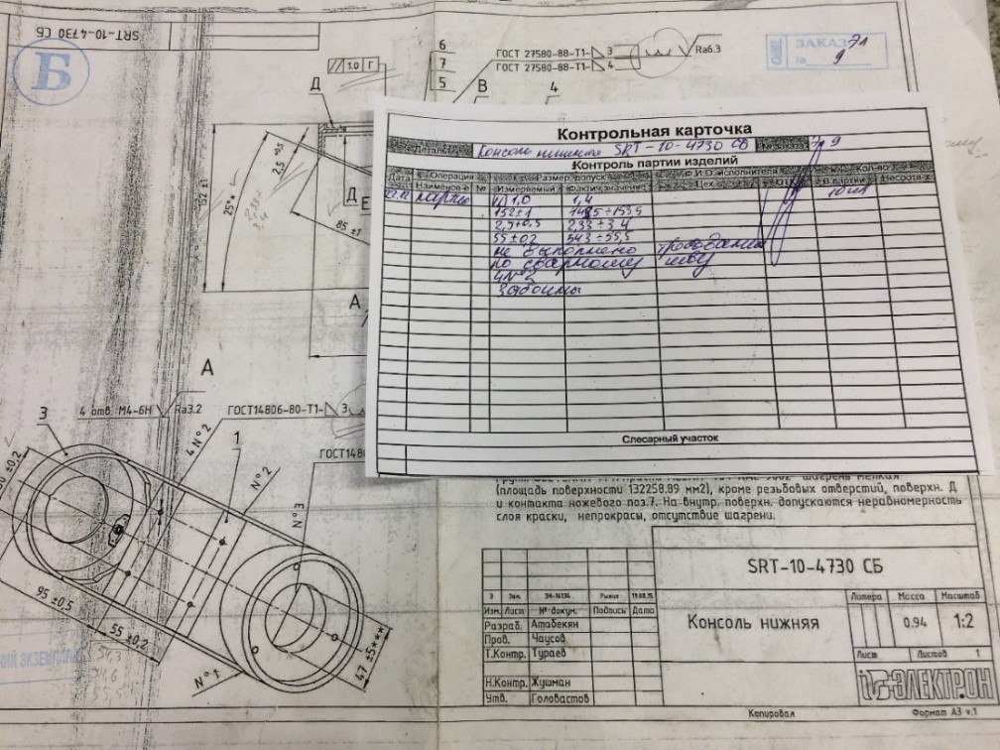

Система менеджмента качества на предприятии
---
### Учебный проект по курсу Java Web Development
### Автор: Галдович Александр
#### [Go to EN](#english)
### Оглавление 
* [Пара слов о себе](#пара_слов)
* [Общее описание](#общее_описание)
* [Пользователи](#пользователи)
* [Состояния процесса производства](#состояния)
* [Маршрутные карты](#маршрутные_карты)
* [Заказы](#заказы)
* [В перспективе](#перспектива)

### Пара слов о себе 
Я работаю начальником отдела технического контроля на чатной фирме, которая специализируется на механической обработки материалов. В течение 3-ех лет, которые я отдал фирме, мною постоянно фиксировались недостатки в существующей системе производства, начиная с этапов проектирования изделий и заканчивая обратной связью между процессами производства и директором. Именно по этой причине у меня и родилась идея по созданию системы, которая могла бы усовершенствовать существующую систему производства или даже стать толчком для создания новой! 
### Общее описание 
Веб приложение является концепцией десктопного приложения. Приложение обеспеченивает прослеживаемость процессов производства на фирме, учет всех заказов и выпускаемой продукции, а также мониторинг активности за рабочими. 

### Пользователи 
* **Гость**  
  Неавторизированный пользователь.
    
  Функциональные возможности:
    * Просмотр домашней страницы
    * Смена языка сайта
    * Регистрация и аутентификация
  
* **Рабочий**  
  Зарегистрированный рабочий в системе. Статус присваивается по умолчанию после регистрации.
  
  Функциональные возможности:
    * Просмотр домашней страницы
    * Смена языка сайта
    * Поиск изделия
    * Создание отметки в маршрутной карте
    * Просмотр профиля
    
* **Администратор**  
  Администратор имеет полный доступ к системе. Этими правами наделяются рабочие имеющие такие обязанности как создание заказов и проектирование 3д модели изделий. Директор и начальники отделов также имееют права доступа "Администратор" для поддержания обратной связи на производстве.  
  
  Функциональные возможности:
   * Доступ к общему мониторингу
   * Смена языка сайта
   * Просмотр, добавление, изменение пользователей
   * Просмотр, добавление, изменение изделий

### Состояния процесса производства 
Система позволяет совершать мониторинг за этапами производства изделия. Для этого внедрена шкала процесса выполнения, а также поле "Состояние процесса". Каждому состоянию соответствует свой цвет.

  

### Маршрутный карты 
Маршрутная карта (далее-МК) относится к числу обязательных технологических документов. МК содержит описание последовательности выполнения технологических операций. На нашей фирме это технология работает на формальном уровне (см. картинку ниже). 

  

В данном проекте была реализована усовершенственная концепция МК, которая обеспечивает прослеживаемость всех операций на производстве и учавствует в составлении мониторинга.

### В перспективе
На производстве существует парк средств измерений, позволяют быстро выполнять измерения в автоматическом режиме, а также обеспечивают удобство работы и передачи данных по беспроводным каналам связи. Результаты измерений, которые выполняются с высокой частотой, передаются по сети напрямую на производственную линию в цех — будь то 100-процентный или выборочный контроль. Планируется интеграция всех средств измерений в одну систему, для быстрого считывания массива данных об измерениях.

## Quality System Managment
---
### Study project for the course Java Web Development
### Author: Galdovich Alexander
#### [Перейти на русский](#русский)
### Table of contents
* [A few words about myself](#few_words)
* [General description](#description)
* [Users](#users)
* [Manufacturing process states](#states)
* [Route maps](#route_maps)
* [In perspective](#perspective)

### A few words about myself 
I work as the head of the technical control department for a private company that specializes in the machining of materials. During the 3 years that I gave to the company, I have constantly fixed shortcomings in the existing production system, starting from the stages of product design and ending with feedback between production processes and the director. It is for this reason that I came up with the idea of ​​creating a system that could improve the existing production system or even become an impetus for creating a new one!

### General description 

### Users 
* **Guest**  
  Unauthorized user.
    
  Functionality:
     * View home page
     * Change site language
     * Registration and Authentication
  
* **Worker**  
  The registered worker in the system. The status is assigned by default after registration.
  
  Functionality:
     * View home page
     * Change site language
     * Product search
     * Create a mark in the route map
     * View profile
    
    
* **Admin**  
  The administrator has full access to the system. These rights are given to workers with duties such as creating orders and designing a 3D model of products. The director and department heads also have "Administrator" access rights to maintain feedback in production.
  
  Functionality:
     * View, add, change users
     * View, add, change products

### Manufacturing process states
The system allows monitoring the stages of product manufacturing. For this, a progress bar has been introduced, as well as the "Process status" field. Each state has its own color.

  

### Route maps 
The route map (hereinafter-MK) is one of the mandatory technological documents. MK contains a description of the sequence of technological operations. In our company, this technology works on a formal level (see the picture below).

  

In this project, an improved MC concept was implemented, which ensures the traceability of all operations in production and participates in the preparation of monitoring.

### In perspective 
 There is a fleet of measuring instruments at the production site, they allow you to quickly carry out measurements in an automatic mode, and also provide the convenience of operation and data transmission via wireless communication channels. The measurement results, which are carried out at high frequency, are transmitted over the network directly to the production line in the workshop - be it 100% inspection or sampling. It is planned to integrate all measuring instruments into one system for quick reading of an array of measurement data.
    
