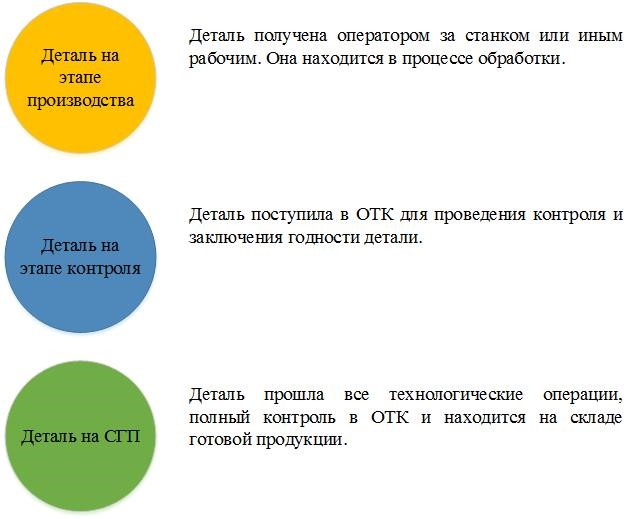

Система менеджмента качества на предприятии
---
### Учебный проект по курсу Java Web Development
### Автор: Галдович Александр
#### [Go to EN](#english)
### Оглавление 
* [Пара слов о себе](#пара_слов)
* [Общее описание](#общее_описание)
* [Пользователи](#пользователи)
* [Заказчики](#заказчики)
* [Заказы](#заказы)

### Пара слов о себе 
Я работаю начальником отдела технического контроля на чатной фирме, которая специализируется на механической обработки материалов. В течение 3-ех лет, которые я отдал фирме, мною постоянно фиксировались недостатки в существующей системе производства, начиная с этапов проектирования изделий и заканчивая обратной связью между процессами производства и директором. Именно по этой причине у меня и родилась идея по созданию системы, которая могла бы усовершенствовать существующую систему производства или даже стать толчком для создания новой! 
### Общее описание 

### Состояние процесса производства
Система позволяет совершать мониторинг за этапами производства изделия. Для этого внедрена шкала процесса выполнения, а также поле "Состояние процесса". Каждому состоянию соответствует свой цвет.

  

### Пользователи 
* **Гость**  
  Неавторизированный пользователь.
    
  Функциональные возможности:
    * Просмотр домашней страницы
    * Смена языка сайта
    * Регистрация и аутентификация
  
* **Рабочий**  
  Зарегистрированный рабочий в системе. Статус присваивается по умолчанию после регистрации.
  
  Функциональные возможности:
    * Просмотр домашней страницы
    * Смена языка сайта
    * Поиск изделия
    * Создание отметки в маршрутной карте
    * Просмотр профиля
    
* **Администратор**  
  Администратор имеет полный доступ к системе. Этими правами наделяются рабочие имеющие такие обязанности как создание заказов и проектирование 3д модели изделий. Директор и начальники отделов также имееют права доступа "Администратор" для поддержания обратной связи на производстве.  
  
  Функциональные возможности:
   * Доступ к общему мониторингу
   * Смена языка сайта
   * Просмотр, добавление, изменение пользователей
   * Просмотр, добавление, изменение изделий

### Заказчики 

## Quality System Managment
---
### Study project for the course Java Web Development
### Author: Galdovich Alexander
#### [Перейти на русский](#русский)
### Table of contents
* [A few words about myself](#few_words)
* [General description](#description)
* [Users](#users)
* [Customers](#customers)
* [Orders](#orders)

### A few words about myself 
I work as the head of the technical control department for a private company that specializes in the machining of materials. During the 3 years that I gave to the company, I have constantly fixed shortcomings in the existing production system, starting from the stages of product design and ending with feedback between production processes and the director. It is for this reason that I came up with the idea of ​​creating a system that could improve the existing production system or even become an impetus for creating a new one!

### General description 

### Users 
* **Guest**  
  Unauthorized user.
    
  Functionality:
     * View home page
     * Change site language
     * Registration and Authentication
  
* **Worker**  
  The registered worker in the system. The status is assigned by default after registration.
  
  Functionality:
     * View home page
     * Change site language
     * Product search
     * Create a mark in the route map
     * View profile
    
    
* **Admin**  
  The administrator has full access to the system. These rights are given to workers with duties such as creating orders and designing a 3D model of products. The director and department heads also have "Administrator" access rights to maintain feedback in production.
  
  Functionality:
     * View, add, change users
     * View, add, change products
 
### Customers 
    
    
